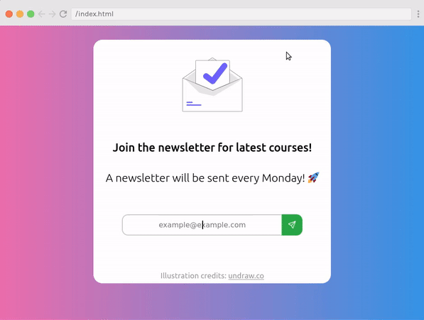

# Newsletter form

This is my submission for Scrimba's [#WeeklyWebDevChallenge](https://twitter.com/scrimba/status/1316410239672111106) on `Oct 14 2020`,  where it was recognized as the [1st Runner up](https://twitter.com/scrimba/status/1317151410954424320) among 70 other submissions.

You can try it out [here](https://kaustubhdamania.github.io/Newsletter-Form/).

### Demo

    

 

#### SVG credits: [Tabler Icons](https://tablericons.com/) and [Undraw](https://undraw.co/illustrations).